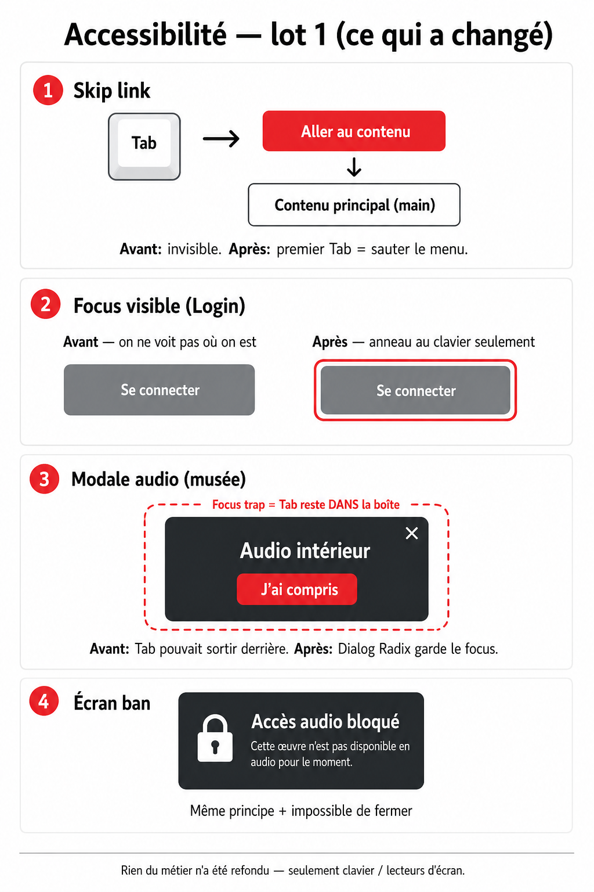
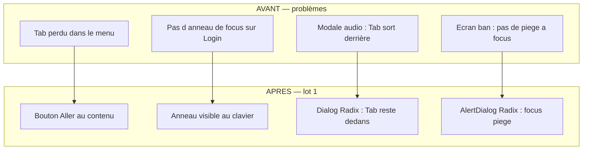
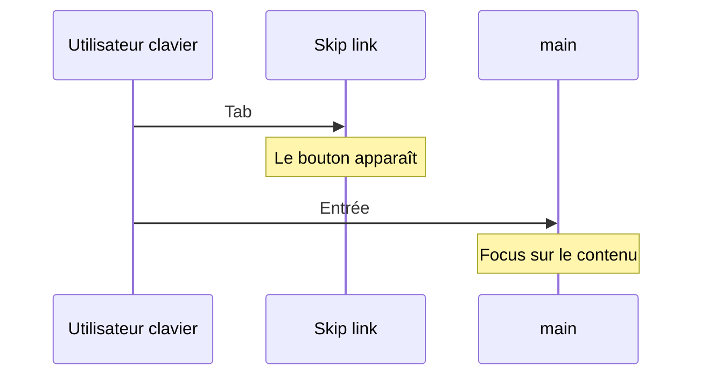
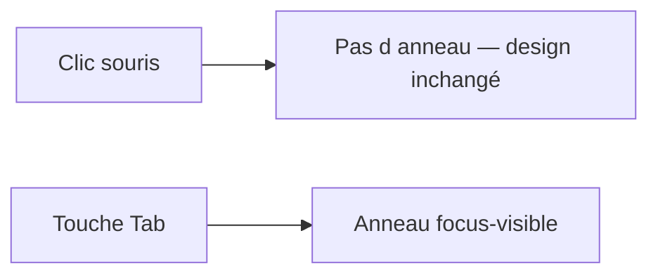
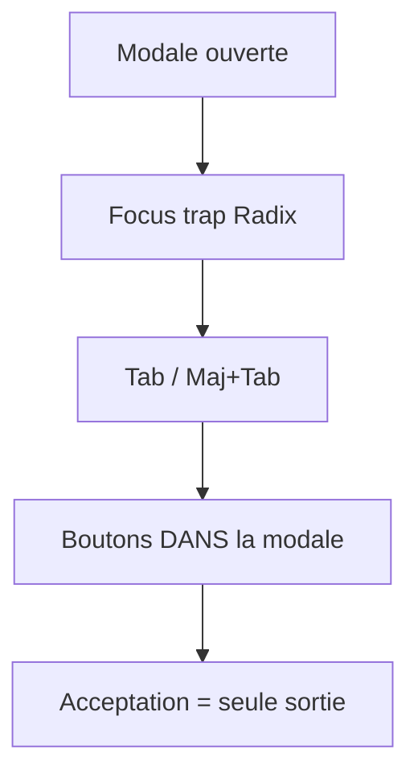

# Accessibilité — Lot 1 : ce qui a changé (visuel)

> Document **simple** pour comprendre les correctifs WCAG du parcours Login / QR.  
> Aucune refonte métier : uniquement clavier et lecteurs d’écran.



---

**Où le voir dans le navigateur (DEV) :**

1. Ouvre **http://localhost:8080/dev/a11y-demo**
2. Suis les 4 blocs sur la page (boutons pour ouvrir les modales)
3. Pour le focus Login : bouton « Ouvrir /login » ou **http://localhost:8080/login** puis touche **Tab**

---

## Vue d’ensemble



---

## 1. Skip link — « Aller au contenu »

### Avant

```text
[ Header / menu / FAB ]
[ Header / menu / FAB ]   ← Tab Tab Tab Tab…
[ Header / menu / FAB ]
        ↓
[ Contenu utile ]         ← longtemps pour y arriver
```

### Après

```text
Tab (1ère fois)
        ↓
┌─────────────────────┐
│  Aller au contenu   │  ← bouton rouge (visible seulement au focus)
└─────────────────────┘
        ↓ (Entrée / clic)
┌─────────────────────┐
│  Contenu principal  │  ← id="main-content"
└─────────────────────┘
```



**Où le voir :** ouvre `/login`, appuie une fois sur **Tab**.

---

## 2. Anneau de focus (page Login)

### Avant

```text
┌──────────────┐
│ 👁 mot de passe │  ← focus clavier SANS contour
└──────────────┘
  On ne sait pas où on est.
```

### Après

```text
┌──────────────────┐
│ 👁 mot de passe    │
└──────────────────┘
   ↑↑↑ anneau visible
   (seulement au Tab, pas à la souris)
```



**Où le voir :** `/login` → Tab jusqu’au bouton œil / « mot de passe oublié».

---

## 3. Modale audio intérieur (parcours QR)

### Avant

```text
╔══════════════════════╗
║  Modale audio        ║
║  [ J'ai compris ]    ║
╚══════════════════════╝
         ↕ Tab pouvait sortir
┌──────────────────────┐
║  Page derrière       ║  ← mauvaise expérience clavier
└──────────────────────┘
```

### Après

```text
████ Fond assombri ████
╔══════════════════════╗
║  Modale audio        ║  ← FOCUS TRAP
║  Tab reste ICI       ║
║  [ J'ai compris ]    ║
╚══════════════════════╝
```



**Comportement métier inchangé :** on ne peut toujours pas fermer sans accepter.

---

## 4. Écran « audio bloqué »

### Avant / Après (même apparence)

```text
╔════════════════════════╗
║  ⛔ Accès audio bloqué ║
║  Message explicatif    ║
╚════════════════════════╝
```

**Ce qui change en coulisse :** vrai `AlertDialog` Radix → le focus ne part plus derrière.  
**Inchangé :** impossible de fermer cet écran.

---

## Récap — fichiers touchés

| Changement | Fichier principal |
|------------|-------------------|
| Skip link | `src/components/SkipToContentLink.tsx` |
| Cible du lien | `src/App.tsx`, `PublicVitrineShell.tsx` (`id="main-content"`) |
| Focus Login | `src/pages/Login.tsx` (+ Register / RegisterSaaS) |
| Modale audio | `src/components/visitor/IndoorAudioOnboardingModal.tsx` |
| Écran ban | `src/components/visitor/AudioBanOverlay.tsx` |

---

## Ce lot n’a PAS modifié

- Design / couleurs / textes des écrans
- Modales commentaire / photo artiste (`VisitorView`)
- Bannière cookies
- Menu mobile vitrine
- Tableaux backoffice

---

*Complément de [`audit-wcag.md`](audit-wcag.md).*
