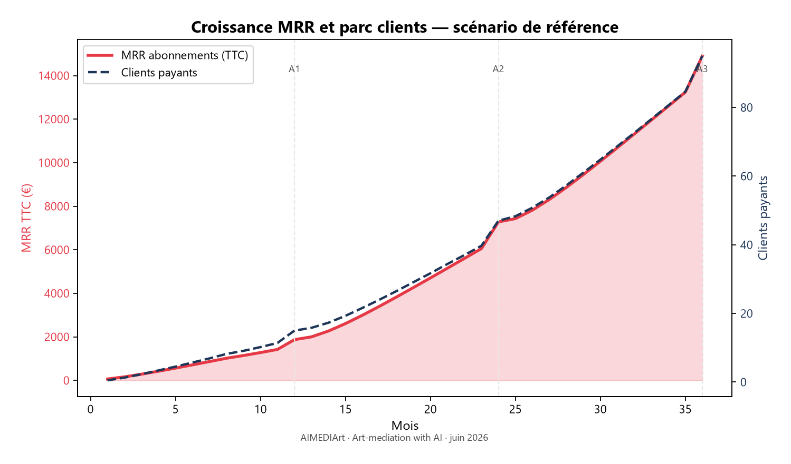
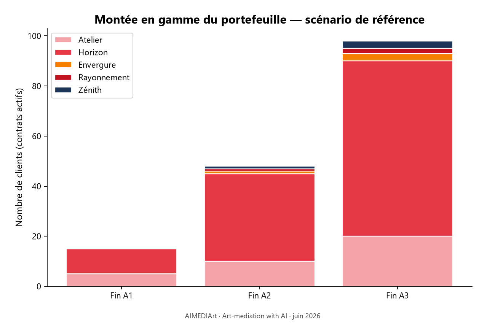

**Art-mediation with AI**[^baseline]

| | |
|---|---|
| **Dénomination** | AIMEDIArt (AIMEDIArt.com) |
| **Document** | Plan d'affaires[^business-plan] — synthèse stratégique et financière |
| **Date** | juillet 2026 |
| **Signe distinctif** | `aimediart-logo-block` — pictogramme cœur (#E63946) · logotype AIMEDIArt.com · baseline *Art-mediation with AI* |
| **Rédaction** | DUPONT Fabien |

---

# Plan d'affaires AIMEDIArt

**Document de synthèse — juillet 2026**  
*Art-mediation with AI — logiciel en ligne[^saas-b2b] pour professionnels[^b2b] de la médiation culturelle*

---

## 1. Synthèse exécutive[^executive-summary]

AIMEDIArt est une plateforme en ligne[^saas-b2b] qui permet aux institutions culturelles de produire, diffuser et mesurer une médiation numérique multilingue (textes IA, audioguides, codes QR[^qr], statistiques d’émotion et cartographie des visiteurs) à partir d’une simple photographie d’œuvre.

**Modèle économique :** abonnements récurrents (Atelier, Horizon, L'Envergure, Rayonnement), essai gratuit (Étincelle), grands événements sur devis (Zénith), complété par options, dépassements et plan veille.

**Marché adressable (France) :** 25 000 à 30 000 expositions/an, portées par ~1 220 Musées de France, ~2 200 galeries et ~51 centres d’art contemporain (réseau DCA[^dca]).

**Objectif 3 ans — scénario de référence :**

| Indicateur | Fin A1 | Fin A2 | Fin A3 |
|------------|--------|--------|--------|
| Clients totaux (tous abonnements) | 25 | 68 | 128 |
| Clients payants (hors Étincelle) | 15 | 47 | 95 |
| Revenu récurrent mensuel[^mrr] TTC | ~1 890 € | ~7 400 € | ~15 250 € |
| Chiffre d'affaires HT annuel | ~8 200 € | ~55 000 € | ~136 300 € |
| Excédent brut d'exploitation[^ebitda] (1 développeur dès A2) | ~700 € | ~−12 600 € | ~58 000 € |
| Trésorerie cumulée | ~2 800 € | ~−9 900 € | ~48 200 € |

**Points clés :** produit **opérationnel**[^live], propriété intellectuelle déposée (e-Soleau), trois scénarios modélisés sur 36 mois (voir tableur Excel). Le scénario **ambitieux** (+30 % clients, 5 développeurs) nécessite un financement ; le scénario **prudent** reste autofinançable sans sous-traitance.

---

## 2. Problème et solution

### Problème

Les institutions culturelles produisent leur médiation avec des outils fragmentés : rédaction manuelle, studio audio, traductions coûteuses, QR vers pages statiques, compteurs de passages sans dimension émotionnelle ni origine géographique du public. **Semaines de préparation, un discours unique, peu de retour qualitatif.**

### Solution AIMEDIArt

Une chaîne unifiée : photo → 8 registres de discours × jusqu’à 5 langues × voix audio[^tts] → cartels QR → expérience visiteur sur mobile sans application[^app] → émotion et cœurs à chaud → statistiques et carte géographique.

**Différenciation :** production IA accélérée + contrôle éditorial humain + mesure qualitative + cartographie visiteurs/organisateurs sans suivi GPS[^gps-tracking].

---

## 3. Analyse de marché

*Source : étude « Marché des arts visuels » (hypothèses du plan d'affaires)*

### 3.1 Volume d’expositions en France

| Catégorie | Expositions / an |
|-----------|------------------|
| Peinture, dessin, arts graphiques | 12 000 – 15 000 |
| Photographie | 5 000 – 7 000 |
| Sculpture et installations | 2 500 – 3 500 |
| Art numérique et nouveaux médias | 1 000 – 1 500 |
| Design et arts décoratifs | 800 – 1 200 |
| **Total estimé** | **~25 000 – 30 000** |

**Structures clés :**

- **1 220** Musées de France (3 à 5 expositions temporaires/an chacun)
- **~2 200** galeries privées (renouvellement toutes les 6–8 semaines)
- **51** centres d’art contemporain (réseau DCA[^dca] — ~1,6 M visiteurs/an)
- **43** centres culturels de rencontre (ACCR[^accr], 15 pays)

### 3.2 Segmentation par taille d’exposition

| Format | Œuvres moy. | Part du volume | Part du public |
|--------|-------------|----------------|----------------|
| **S** — Galeries / jeune création | ~15 | 70 % | 10 % |
| **M** — Musées territoriaux / centres d’art | ~60 | 25 % | 30 % |
| **L** — Expositions à fort succès[^blockbusters] / musées nationaux | ~180 | 5 % | 60 % |

**Implication produit :** l'abonnement **Atelier** (100 œuvres) cible le format S–M ; **Horizon** (250 œuvres) le format M ; **L'Envergure** (500 œuvres) et **Rayonnement** (1 000 œuvres) les formats M–L ; **Zénith** les événements exceptionnels.

### 3.3 Saisonnalité

~40 % des expositions entre **avril et juillet** (festivals, foires). Conséquence : pic d’acquisition au printemps, intérêt du **plan veille** hors saison.

### 3.4 Marché total, adressable et capturable

| Niveau | Définition | Volume | Logique |
|--------|-----------|--------|---------|
| **Marché total**[^tam] | Toutes expositions France pouvant utiliser une médiation QR | ~27 000 expos/an | Potentiel théorique |
| **Marché adressable**[^sam] | Structures récurrentes abonnables (musées, centres d’art, galeries haut de gamme[^premium], FRAC[^frac]) | ~3 500 – 4 000 structures | Cible professionnelle récurrente |
| **Part capturable**[^som] A3 | Clients payants AIMEDIArt fin année 3 (référence) | **95 abonnés** + 3 Zénith | ~2,5 – 3 % du marché adressable |

**Priorité géographique :** Île-de-France[^idf] (~47 % de l’offre), puis axes photo (Occitanie, PACA) et pôles design (Auvergne-Rhône-Alpes).

---

## 4. Canevas du modèle économique[^bmc]

### Segments de clientèle

| Segment | Abonnement typique | Besoin principal |
|---------|-----------------|------------------|
| Galeries et petites structures | Étincelle → Atelier | Coût maîtrisé, rapidité |
| Musées territoriaux, centres d’art | Horizon | Volume d'œuvres, multilingue, statistiques |
| Institutions régionales / réseaux | L'Envergure | Quotas étendus, 3 langues + audio |
| Institutions nationales, grands comptes | Rayonnement | 990 €/mois, 1 000 œuvres, 5 000 visiteurs |
| Grands événements (biennale, festival) | Zénith | Projet ponctuel clé en main |

### Propositions de valeur

1. **Produire dix fois plus vite** — médiation complète en heures plutôt qu'en semaines  
2. **Personnaliser** — 8 registres, jusqu'à 5 langues, voix audio  
3. **Mesurer** — émotion par œuvre + carte géographique du public  

### Canaux

- Vente directe (démonstration, site, essai Étincelle 15 jours)
- Réseaux professionnels (DCA[^dca], ICOM[^icom], NEMO[^nemo], ACCR[^accr])
- Partenariats agences / commissaires
- Recommandation curatorale

### Sources de revenus

| Flux | Détail |
|------|--------|
| Abonnements | Atelier 89 €/mois TTC, Horizon 149 €/mois TTC, L'Envergure 499 €/mois TTC, Rayonnement 990 €/mois TTC |
| Facturation annuelle | 11 mois pour 12 (≈ −8,3 % par rapport au mensuel) — Rayonnement : 10 890 € TTC/an |
| Dépassements | Pack +50 œuvres → 45 € |
| Options | Langue médiation supplémentaire +15 € ; langue audio supplémentaire +15 € |
| Plan veille | 29 € (Atelier) / 49 € (Horizon) |
| Sur devis | Zénith (ponctuel 15–17 k€) |

### Ressources clés

- Plateforme en ligne (React, Supabase[^supabase], fonctions serveur[^edge-functions], Groq, synthèse vocale[^tts])
- Grille tarifaire et moteur de facturation[^billing] (`pricing`, `organisation_subscriptions`)
- Propriété intellectuelle (dépôt e-Soleau juin 2026)

### Coûts

- **Infrastructure fixe :** 500 €/mois au départ, +15 %/trimestre (hébergement, outils, administration)
- **Sous-traitance développement :** voir § 6.6 (1 développeur en référence, 5 en ambitieux)
- **Variables :** 1 % du chiffre d'affaires HT (frais bancaires, commissions)
- **Coûts directs de service**[^cogs] **IA :** Groq + OpenAI TTS — suivi via `ai_usage_logs`

---

## 5. Grille tarifaire (référence produit)

*Alignée sur la table `pricing` du projet*

| Abonnement | Prix TTC/mois | Œuvres | Visiteurs/mois | Langues médiation | Audio |
|---------|---------------|--------|----------------|-------------------|-------|
| **Étincelle** | 0 € (essai 15 j) | 10 | 50 | 1 | 0 |
| **Atelier** | 89 € | 100 | 1 000 | 1 | 1 |
| **Horizon** | 149 € | 250 | 1 500 | 2 | 2 |
| **L'Envergure** | 499 € | 500 | 2 500 | 3 | 3 |
| **Rayonnement** | 990 € (10 890 €/an) | 1 000 | 5 000 | 3 | 3 |
| **Zénith** | Sur devis | Événement | Événement | Sur mesure | Oui |

**Options et dépassements :**

- Pack +50 œuvres → **45 €**
- Langue de médiation supplémentaire → **15 €**
- Langue audio supplémentaire → **15 €**
- Plan veille : Atelier **29 €** / Horizon **49 €**

---

## 6. Hypothèses du prévisionnel

*Source : « hypothèses BP.docx » · grille tarifaire produit juillet 2026*

### 6.1 Paramètres généraux

| Paramètre | Valeur |
|-----------|--------|
| Capital initial | 2 100 € |
| Frais fixes infrastructure au départ | 500 €/mois |
| Hausse frais fixes | +15 % / trimestre |
| Frais variables | 1 % du chiffre d'affaires HT |
| TVA[^tva] sur ventes | 20 % |
| TVA déductible sur charges | 20 % |

### 6.2 Attrition clientèle[^churn]

| Paramètre | Valeur |
|-----------|--------|
| Début de l'attrition | Mois 9 |
| Taux d'attrition mensuel initial | 5,0 % |
| Baisse mensuelle du taux | −10 % / mois (composée) |

*Exemple : M9 = 5,0 % → M10 = 4,5 % → M11 = 4,05 % …*

### 6.3 Effectifs clients (fin d’année, cumul) — scénario de référence

| Abonnement | Fin A1 | Fin A2 | Fin A3 |
|---------|--------|--------|--------|
| Étincelle | 10 | 20 | 30 |
| Atelier | 5 | 10 | 20 |
| Horizon | 10 | 35 | 70 |
| L'Envergure | 0 | 1 | 3 |
| Rayonnement | 0 | 1 | 2 |
| Zénith (contrats actifs) | 0 | 1 | 3 |
| **Total** | **25** | **68** | **128** |

*Scénarios prudent / ambitieux : effectifs × 0,70 / × 1,30.*

### 6.4 Paramètres commerciaux

| Paramètre | A1 | A2 | A3 |
|-----------|----|----|-----|
| Facturation mensuelle (vs annuelle) | 60 % | 50 % | 40 % |
| % clients avec dépassements/options | 5 % | 10 % | 12 % |
| Panier moyen options / dépassements (€/mois) | 20 | 25 | 30 |
| Panier moyen Zénith (€, ponctuel) | — | 15 000 | 17 000 |
| **Conversion Étincelle → payant**[^conversion-etincelle] | **50 %** | **50 %** | **50 %** |

*Cible : **50 %** des organisations ayant souscrit à l'essai Étincelle passent à un abonnement payant (Atelier, Horizon ou au-delà) à l'issue ou pendant la période d'essai.*

### 6.5 Tarif Rayonnement

| Paramètre | Valeur | Note |
|-----------|--------|------|
| **Rayonnement — abonnement mensuel** | **990 € TTC** | Grands comptes, 1 000 œuvres / 5 000 visiteurs |
| **Rayonnement — abonnement annuel** | **10 890 € TTC** | 11 mois pour 12 (990 € × 11) |

### 6.6 Sous-traitance développeurs

| Scénario | Effectif | Démarrage | Coût unitaire |
|----------|----------|-----------|---------------|
| **Prudent** | 0 | — | — |
| **Référence** | 1 développeur | Mois 13 (début A2) | 4 500 € HT/mois[^tjm] |
| **Ambitieux** | 2 → 5 développeurs | M1 : 2 · M7 : 3 · M13 : 4 · M19+ : 5 | 4 500 € HT/mois/développeur |

*Hypothèse TJM[^tjm] 450 € × 10 jours/mois. Le fondateur reste porteur produit ; la sous-traitance couvre l'accélération technique (paiement en ligne, Union européenne, plans premium).*

---

## 7. Prévisionnel financier — 3 scénarios

*Détail mensuel : `docs/business-plan-previsionnel-36m-new.xlsx` · généré par `scripts/generate_bp_excel.py`*

### 7.1 Synthèse annuelle (€ HT)

| Poste | Prudent A3 | Référence A3 | Ambitieux A3 |
|-------|------------|--------------|--------------|
| **Chiffre d'affaires HT total** | 94 552 | 136 315 | 168 633 |
| Sous-traitance développement (cumul 3 ans) | 0 | ~108 000 | ~648 000 |
| **Excédent brut cumulé (3 ans)**[^ebitda] | 99 606 | 46 053 | −448 849 |
| **Trésorerie fin A3** | 101 707 | 48 154 | −446 749 |
| Développeurs actifs fin A3 | 0 | 1 | 5 |

### 7.2 Scénario de référence — compte de résultat

| Poste | Année 1 | Année 2 | Année 3 |
|-------|---------|---------|---------|
| **Abonnements récurrents** | 8 163 | 41 793 | 105 539 |
| **Options et dépassements** | 66 | 715 | 2 442 |
| **Zénith (projets ponctuels)** | 0 | 12 500 | 28 333 |
| **Chiffre d'affaires HT total** | **8 228** | **55 009** | **136 315** |
| Frais variables (1 %) | −82 | −550 | −1 363 |
| Frais fixes infrastructure | −7 490 | −13 100 | −22 912 |
| Sous-traitance développement | 0 | −54 000 | −54 000 |
| **Excédent brut d'exploitation** | **≈ 656** | **≈ −12 642** | **≈ 58 039** |

### 7.3 Indicateurs récurrents (référence, fin d’année)

| Indicateur[^kpi] | A1 | A2 | A3 |
|------------------|----|----|-----|
| Revenu récurrent mensuel[^mrr] TTC (abo + options) | 1 886 € | 7 395 € | 15 245 € |
| Revenu récurrent annuel[^arr] TTC (× 12) | 22 632 € | 88 740 € | 182 940 € |
| Clients payants (abonnement) | 15 | 47 | 95 |
| Revenu moyen par client[^arpu] TTC/mois | ~126 € | ~157 € | ~160 € |
| Trésorerie cumulée | ~2 800 € | ~−9 900 € | ~48 200 € |

### 7.4 Lecture stratégique

- **Prudent** : croissance lente, pas de développeur externalisé → trésorerie confortable (~102 k€) mais montée en charge[^scale] limitée.
- **Référence** : équilibre produit / trésorerie — 1 développeur dès A2, creux en A2 (~−10 k€), remontée en A3 (~48 k€ de trésorerie).
- **Ambitieux** : 5 développeurs, +30 % clients → **consommation de trésorerie**[^burn] importante → levée de fonds ~500 k€ recommandée pour tenir 24 mois.

---

## 8. Économie unitaire et attrition

### Valeur vie client[^ltv] estimée (ordre de grandeur)

| Abonnement | Revenu moyen/client TTC/mois | Attrition mensuelle estimée | Valeur vie client TTC |
|---------|------------------------------|----------------------------|------------------------|
| Atelier | 89 € | ~3 %/mois | ~3 000 € |
| Horizon | 149 € | ~1,5 %/mois | ~9 900 € |
| L'Envergure | 499 € | ~1 %/mois | ~50 000 € |
| Rayonnement | 990 € | ~1 %/mois | ~99 000 € |

*Valeur vie client ≈ revenu moyen par client ÷ attrition mensuelle, avec taux décroissant selon hypothèses.*

### Répartition des revenus A3 (référence)

| Abonnement | Clients | Revenu récurrent mensuel TTC estimé |
|---------|---------|-------------------------------------|
| Atelier (20) | 20 | ~1 690 € |
| Horizon (70) | 70 | ~9 910 € |
| L'Envergure (3) | 3 | ~1 420 € |
| Rayonnement (2) | 2 | ~1 880 € |
| Options (12 % × 95) | — | ~340 € |
| **Total** | | **~15 240 €** |

---

## 9. Stratégie de mise sur le marché[^gtm]

### Phase 1 — A1 : Validation (0 → 25 clients)

- Essai **Étincelle** gratuit (15 j, 10 œuvres) comme **entonnoir d'acquisition**[^funnel]
- Ciblage **centres d’art DCA** et **musées territoriaux** (format M, 60 œuvres/expo)
- Démonstrations curatorales, 5 Atelier + 10 Horizon fin A1
- Objectif : **50 % de conversion** Étincelle → payant[^conversion-etincelle] et rétention après l'attrition à partir de M9

### Phase 2 — A2 : Accélération (25 → 68 clients)

- Montée en charge **Horizon** (35 clients) — cœur de volume
- Premiers **L'Envergure** (1), **Rayonnement** (1) et **Zénith** (1 × 15 k€)
- **1 développeur** sous-traité pour paiement en ligne et facturation
- Activation réseaux (DCA, festivals photo Arles / Perpignan)

### Phase 3 — A3 : Déploiement régional (68 → 128 clients)

- **70 Horizon** — ancrage musées de province
- **3 L'Envergure** + **2 Rayonnement** + **3 Zénith** — grands comptes
- Dépassements à 12 % — **montée en gamme**[^upsell] naturelle via quotas
- Extension géographique hors Île-de-France

---

## 10. Feuille de route produit (alignée sur le code source)

| Période | Fonctionnalité | Statut |
|---------|----------------|--------|
| A1 | Parcours guidé[^workflow] de création d'œuvre | ✅ En production |
| A1 | Abonnements en libre-service[^self-service] (Étincelle → Horizon) | ✅ Procédure `subscribe_organisation_plan` |
| A1 | Statistiques émotion + carte géographique | ✅ |
| A2 | Paiement en ligne (Stripe) | 🔜 Prévu |
| A2 | Facturation automatique des dépassements | ✅ Schéma `pricing_overage_rules` |
| A3 | L'Envergure / Rayonnement (990 €) / Zénith — contrats sur devis | 🔜 Processus manuel |
| A3 | Expansion Union européenne (5 langues déjà supportées) | 🔜 Commercial |

---

## 11. Risques et mesures correctives

| Risque | Impact | Mesure corrective |
|--------|--------|-------------------|
| Attrition élevée après M9 | Retard de croissance | Accueil renforcé[^onboarding], plan veille hors saison |
| Coût IA non maîtrisé | Érosion de marge | Quotas par abonnement, suivi `ai_usage_logs`, passage automatique à l'abonnement supérieur[^upgrade] |
| Saisonnalité des expositions | Revenu récurrent instable | Plan veille (29–49 €/mois), contrats annuels |
| Sous-traitance (référence) | Creux de trésorerie en A2 | Décalage du recrutement ou levée préventive |
| Scénario ambitieux | Consommation > 445 k€ | Financement avant M7 |

---

## 12. Livrables et prochaines étapes

### Livrables disponibles

- [x] Plan d'affaires complet (ce document)
- [x] Index des annexes A, B et C (`business-plan-index-annexes.docx`)
- [x] Visuels du dossier — graphiques (`docs/assets/bp/`, script `scripts/generate_bp_charts.py`)
- [x] Export Excel 36 mois — 3 scénarios (`business-plan-previsionnel-36m-new.xlsx`)
- [x] Présentation investisseur 10 slides (`pitch-investisseur-aimediart.md`)
- [ ] Dossier BPI / French Tech

### À valider

1. **Coût IA moyen par client** (données `SettingsCouts`)  
2. **Date exacte** de démarrage de la sous-traitance (M13 retenu en référence)

---

## Annexe A — Méthodologie de calcul

*Schéma Annexe A — règles de modélisation du prévisionnel 36 mois.*

1. **Montée progressive linéaire**[^rampup] des effectifs payants sur chaque année, ajustement[^snap] en fin d’année aux cibles du tableau d'hypothèses  
2. **Attrition** appliquée à partir du mois 9, taux diminuant de 10 % par mois  
3. **Facturation annuelle** : coefficient 11/12 sur la part non mensuelle (ex. Rayonnement 10 890 € TTC/an)  
4. **Zénith** : 1 contrat à 15 000 € TTC en A2 ; 2 contrats à 17 000 € TTC en A3  
5. **TVA** : chiffre d'affaires présenté HT ; charges HT  
6. **Scénarios** : effectifs clients × 0,70 / × 1,00 / × 1,30  

---

## Annexe B — Références projet

*Index détaillé : `docs/business-plan-index-annexes.docx`*

| Élément | Fichier / table |
|---------|-----------------|
| Grille tarifaire initiale | `supabase/migrations/migration_79_pricing_billing_schema.sql` |
| Abonnements Zénith | `20260619120100_pricing_five_plans_zenith.sql` |
| Plaidoyer marketing | `docs/pitch-marketing-aimediart.md` |
| Architecture et propriété intellectuelle | `docs/enveloppe-e-soleau-aimediart.md` |
| Générateur Excel | `scripts/generate_bp_excel.py` |

---

## Annexe C — Glossaire

Définitions des termes utilisés dans ce document (équivalents anglo-saxons entre parenthèses le cas échéant).

| Terme | Définition |
|-------|------------|
| **Plan d'affaires** (*business plan*) | Document de synthèse stratégique, commerciale et financière. |
| **Synthèse exécutive** (*executive summary*) | Résumé en tête de document pour les décideurs. |
| **Logiciel en ligne** (*SaaS*) | Application hébergée, accessible par abonnement sans installation. |
| **B2B** | Vente à des institutions ou entreprises, non au grand public. |
| **MRR** | Revenu récurrent mensuel (abonnements + options). |
| **ARR** | Revenu récurrent annuel (MRR × 12). |
| **ARPU** | Revenu moyen par client payant et par mois. |
| **LTV** | Valeur vie client — revenu total estimé sur la durée de relation. |
| **Attrition** (*churn*) | Proportion de clients qui résilient chaque mois. |
| **EBITDA** | Excédent brut d'exploitation (avant intérêts, impôts, amortissements). |
| **COGS** | Coûts directs de service (appels IA, usage à la demande). |
| **TAM / SAM / SOM** | Marché total / adressable / part capturable. |
| **GTM** | Stratégie de mise sur le marché. |
| **Entonnoir** (*funnel*) | Parcours de conversion prospects → clients payants. |
| **TJM** | Taux journalier moyen de prestation (ici 450 € HT). |
| **Burn** | Consommation nette de trésorerie lorsque les charges dépassent les encaissements. |
| **Ramp-up / snap** | Montée progressive linéaire des effectifs, puis recalage fin d'année. |
| **TTS** | Synthèse vocale (*Text-to-Speech*). |
| **Upsell / upgrade** | Montée en gamme vers un abonnement ou des options supérieurs. |
| **Onboarding** | Accueil et prise en main des nouveaux clients. |

---

## Notes de bas de page

*Les appels de note dans le texte renvoient aux définitions ci-dessous (notes de bas de page dans les exports Word/PDF).*

[^baseline]: **Baseline** (angl.) — signature ou slogan de marque ; ici : *Art-mediation with AI* (« médiation artistique avec IA »).
[^business-plan]: **Plan d'affaires** (*business plan*) — document de synthèse stratégique, commerciale et financière.
[^executive-summary]: **Synthèse exécutive** (*executive summary*) — résumé en tête de document pour les décideurs.
[^saas-b2b]: **Logiciel en ligne** (*Software as a Service*, SaaS) — application hébergée, accessible par abonnement sans installation.
[^b2b]: **Professionnel à professionnel** (*Business to Business*, B2B) — vente à des institutions ou entreprises, non au grand public.
[^live]: **Opérationnel** (*live*) — produit déployé et utilisable en conditions réelles.
[^qr]: **Code QR** — code-barres bidimensionnel scanné par le visiteur pour accéder à la médiation numérique.
[^app]: **Application** (*app*, abrév. de *application*) — logiciel sur téléphone ; ici volontairement non requis pour le visiteur.
[^gps-tracking]: **Suivi GPS** (*tracking*) — géolocalisation continue du téléphone ; AIMEDIArt s'en dispense (adresse postale ou adresse IP uniquement).
[^dca]: **DCA** — Association pour la Documentation et la Recherche en Centres d'Art ; 51 centres d'art contemporain en France (~1,6 M visiteurs/an).
[^accr]: **ACCR** — Association des Centres Culturels de Rencontre ; 43 centres dans 15 pays.
[^icom]: **ICOM** — Conseil international des musées (*International Council of Museums*) ; siège à Paris.
[^nemo]: **NEMO** — Réseau des organisations européennes de musées (*Network of European Museum Organisations*) ; siège à Berlin.
[^tam]: **Marché total** (*Total Addressable Market*, TAM) — potentiel théorique maximal (~27 000 expositions/an en France).
[^sam]: **Marché adressable** (*Serviceable Addressable Market*, SAM) — segment réalistement ciblable (~3 500–4 000 structures).
[^som]: **Part de marché capturable** (*Serviceable Obtainable Market*, SOM) — objectif atteignable à 3 ans (95 clients payants en scénario de référence).
[^premium]: **Haut de gamme** (*premium*) — structures à fort potentiel de revenu ou de visibilité.
[^frac]: **FRAC** — Fonds régionaux d'art contemporain ; 28 collections publiques en France.
[^idf]: **Île-de-France** — région concentrant ~47 % de l'offre d'expositions.
[^blockbusters]: **Expositions à fort succès** (*blockbusters*) — rétrospectives à très forte affluence, format « L » (~180 œuvres).
[^bmc]: **Canevas du modèle économique** (*Business Model Canvas*) — schéma en 9 blocs : segments, offre, canaux, revenus, coûts, etc.
[^supabase]: **Supabase** — plateforme d'infrastructure cloud (base PostgreSQL, authentification, stockage).
[^edge-functions]: **Fonctions serveur** (*Edge Functions*) — micro-programmes exécutés côté hébergeur, à la demande.
[^billing]: **Facturation** (*billing*) — ensemble des processus de tarification, encaissement et suivi des abonnements.
[^tts]: **Synthèse vocale** (*Text-to-Speech*, TTS) — conversion automatique des textes en audioguides.
[^mrr]: **Revenu récurrent mensuel** (*Monthly Recurring Revenue*, MRR) — somme des abonnements et options facturés chaque mois.
[^arr]: **Revenu récurrent annuel** (*Annual Recurring Revenue*, ARR) — revenu récurrent mensuel × 12.
[^arpu]: **Revenu moyen par client** (*Average Revenue Per User*, ARPU) — chiffre d'affaires récurrent divisé par le nombre de clients payants.
[^ltv]: **Valeur vie client** (*Lifetime Value*, LTV) — revenu total estimé sur toute la durée de relation avec un client.
[^churn]: **Attrition** (*churn*) — proportion de clients qui résilient chaque mois (5 % initial à M9, puis décroissance de 10 %/mois sur le taux).
[^ebitda]: **Excédent brut d'exploitation** (*EBITDA*) — résultat avant intérêts, impôts, dépréciations et amortissements ; indicateur de performance opérationnelle.
[^kpi]: **Indicateur clé de performance** (*Key Performance Indicator*, KPI).
[^cogs]: **Coûts directs de service** (*Cost of Goods Sold*, COGS) — dépenses variables liées à la production du service (appels IA, hébergement à l'usage).
[^tva]: **TVA** — taxe sur la valeur ajoutée (20 % en France).
[^tjm]: **Taux journalier moyen** (*TJM*) — prix d'une journée de prestation ; ici 450 € HT × 10 j/mois = 4 500 € HT/mois.
[^burn]: **Consommation de trésorerie** (*burn rate*, *cash burn*) — perte nette de cash par mois lorsque les charges dépassent les encaissements.
[^scale]: **Montée en charge** (*scale*) — passage à plus grande échelle (clients, revenus, équipe).
[^gtm]: **Mise sur le marché** (*go-to-market*, GTM) — stratégie commerciale et opérationnelle de lancement et de croissance.
[^funnel]: **Entonnoir d'acquisition** (*funnel*) — parcours de conversion des prospects (essai gratuit → client payant).
[^conversion-etincelle]: **Conversion Étincelle → payant** — part des organisations en essai gratuit qui souscrivent un abonnement payant ; **cible fixée à 50 %** sur les trois années du prévisionnel.
[^upsell]: **Montée en gamme** (*upsell*) — vente d'un abonnement supérieur ou d'options additionnelles.
[^workflow]: **Parcours guidé** (*workflow*) — enchaînement d'étapes dans l'interface (identité → analyse → médiation → audio → QR).
[^self-service]: **Libre-service** (*self-service*) — souscription et gestion sans intervention manuelle de l'éditeur.
[^onboarding]: **Accueil et prise en main** (*onboarding*) — accompagnement des nouveaux clients à l'adoption du produit.
[^upgrade]: **Passage à l'abonnement supérieur** (*upgrade*) — migration automatique ou recommandée vers un plan plus complet.
[^rampup]: **Montée progressive linéaire** (*ramp-up*) — augmentation régulière des effectifs clients mois par mois jusqu'à la cible annuelle.
[^snap]: **Ajustement** (*snap*) — recalage des chiffres en fin de période sur la cible fixée.

---

*Document généré à partir des hypothèses du plan d'affaires et de l'étude marché fournies — juillet 2026.*
