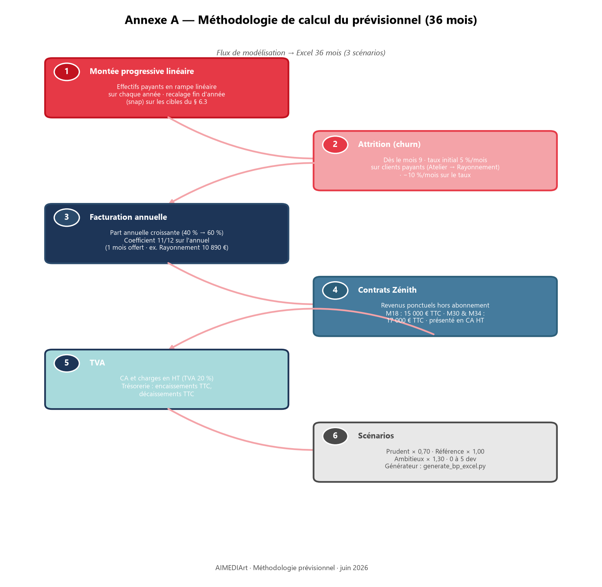

<div align="center">


**Art-mediation with AI**

</div>

| | |
|---|---|
| **Dénomination** | AIMEDIArt (AIMEDIArt.com) |
| **Document** | Index des annexes — dossier plan d'affaires |
| **Date** | juillet 2026 |
| **Signe distinctif** | `aimediart-logo-block` — pictogramme cœur (#E63946) · logotype AIMEDIArt.com · baseline *Art-mediation with AI* |
| **Rédaction** | DUPONT Fabien |
| **Document parent** | `docs/business-plan-aimediart.md` / `docs/business-plan-aimediart.docx` |

---

# Index des annexes — Plan d'affaires AIMEDIArt

**Dossier de référence — juillet 2026**

Ce document recense l'ensemble des pièces du dossier plan d'affaires. Il complète le document principal en détaillant la **méthodologie de calcul** (annexe A), les **références projet** (annexe B) et le **glossaire** (annexe C), ainsi que les livrables associés.

---

## 1. Document principal

| N° | Titre | Fichier | Format | Description |
|----|-------|---------|--------|-------------|
| 1 | Plan d'affaires AIMEDIArt | `docs/business-plan-aimediart.md` | Markdown | Source éditoriale — synthèse stratégique, marché, hypothèses, prévisionnel |
| 1b | Plan d'affaires AIMEDIArt | `docs/business-plan-aimediart.docx` | Word | Export Pandoc du document principal |
| 1c | Plan d'affaires AIMEDIArt | `docs/Pour impression/business-plan-aimediart.pdf` | PDF | Export impression avec notes de bas de page |

---

## 2. Annexe A — Méthodologie de calcul (6 points)

*Référence : sections 6 et 7 du plan d'affaires · détail mensuel dans le tableur Excel.*



### Point 1 — Montée progressive linéaire (*ramp-up*)

Les effectifs clients (tous abonnements confondus) augmentent de façon **linéaire** mois par mois sur chaque année civile, depuis le stock du mois précédent jusqu'à la cible de fin d'année fixée au § 6.3 du plan d'affaires.

- **Ajustement en fin d'année** (*snap*) : le dernier mois de chaque année est recalé exactement sur les effectifs cibles du tableau d'hypothèses.
- **Scénarios prudent / ambitieux** : les cibles de fin d'année sont multipliées par **0,70** ou **1,30** avant application de la montée progressive.
- **Plans concernés** : Étincelle, Atelier, Horizon, L'Envergure, Rayonnement, Zénith (contrats actifs).

### Point 2 — Attrition clientèle (*churn*)

À partir du **mois 9**, une attrition mensuelle est appliquée sur le parc de clients **payants** (Atelier, Horizon, L'Envergure, Rayonnement — hors Étincelle et Zénith).

| Paramètre | Valeur |
|-----------|--------|
| Début | Mois 9 |
| Taux initial | 5,0 % / mois |
| Décroissance du taux | −10 % / mois (composée) |

*Exemple : M9 = 5,0 % → M10 = 4,5 % → M11 = 4,05 % …*

### Point 3 — Facturation annuelle

Une part croissante des abonnements est facturée **à l'année** (paiement unique) plutôt qu'au mois :

| Année | Part facturation mensuelle | Part facturation annuelle |
|-------|---------------------------|---------------------------|
| A1 | 60 % | 40 % |
| A2 | 50 % | 50 % |
| A3 | 40 % | 60 % |

**Coefficient appliqué** sur la part annuelle : **11/12** du tarif mensuel × 12 (un mois offert).  
*Exemple Rayonnement : 990 € × 11 = 10 890 € TTC/an.*

### Point 4 — Contrats Zénith (grands événements)

Revenus ponctuels hors abonnement récurrent, calendrier d'encaissement :

| Mois | Montant TTC | Contexte |
|------|-------------|----------|
| M18 (fin A2) | 15 000 € | 1er contrat Zénith |
| M30 | 17 000 € | 2e contrat Zénith |
| M34 | 17 000 € | 3e contrat Zénith |

Présentation comptable : chiffre d'affaires **HT** (TTC ÷ 1,20).

### Point 5 — TVA

- **Ventes** : chiffre d'affaires présenté **hors taxes** (TVA 20 % déduite).
- **Charges** : infrastructure, sous-traitance et frais variables en **HT** ; TVA déductible à 20 % sur les charges éligibles.
- **Trésorerie** : encaissements TTC, décaissements TTC (charges HT + TVA).

### Point 6 — Scénarios financiers

Trois scénarios sur **36 mois**, générés par `scripts/generate_bp_excel.py` :

| Scénario | Facteur clients | Développeurs sous-traités | Fichier Excel |
|----------|-----------------|----------------------------|---------------|
| **Prudent** | × 0,70 | 0 | `docs/business-plan-previsionnel-36m-new.xlsx` (onglet Prudent) |
| **Référence** | × 1,00 | 1 dès M13 | idem (onglet Base) |
| **Ambitieux** | × 1,30 | 2 → 5 (M1 à M19+) | idem (onglet Ambitieux) |

**Paramètres communs** : capital initial **2 100 €** · frais fixes 500 €/mois (+15 %/trimestre) · frais variables 1 % du CA HT · TJM développeur 450 € × 10 j = 4 500 € HT/mois.

**Grille abonnements (TTC/mois)** : Atelier 89 € · Horizon 149 € · L'Envergure 499 € · Rayonnement 990 €.

---

## 3. Annexe B — Références projet (5 éléments)

| N° | Élément | Chemin | Rôle dans le dossier |
|----|---------|--------|----------------------|
| B1 | Grille tarifaire initiale | `supabase/migrations/migration_79_pricing_billing_schema.sql` | Schéma `pricing`, règles de facturation et dépassements |
| B2 | Abonnements et Zénith | `supabase/migrations/20260619120100_pricing_five_plans_zenith.sql` | Plans Étincelle → Zénith, seeds tarifaires |
| B3 | Plaidoyer marketing | `docs/pitch-marketing-aimediart.md` | Argumentaire institutionnel et positionnement marché |
| B4 | Architecture et propriété intellectuelle | `docs/enveloppe-e-soleau-aimediart.md` | Dépôt e-Soleau, stack technique, preuve d'antériorité |
| B5 | Générateur Excel | `scripts/generate_bp_excel.py` | Script Python — régénération du prévisionnel 36 mois |

---

## 4. Annexe C — Glossaire

*Référence : Annexe C du plan d'affaires (`docs/business-plan-aimediart.md`).*

Tableau des termes métier et financiers (MRR, ARR, churn, LTV, EBITDA, TAM/SAM/SOM, GTM, etc.) utilisés dans le document principal. Les notes de bas de page Markdown `[^…]` du plan d'affaires renvoient aux mêmes définitions dans les exports Word/PDF.

---

## 5. Documents complémentaires du dossier

| N° | Titre | Fichier | Format | Usage |
|----|-------|---------|--------|-------|
| D0 | **Visuels du dossier** | `docs/assets/bp/*.png` | PNG | Graphiques (carte, prévisionnel, workflow…) — `python scripts/generate_bp_charts.py` |
| D1 | Prévisionnel financier 36 mois | `docs/business-plan-previsionnel-36m-new.xlsx` | Excel | Détail mensuel — 3 scénarios (annexe A, point 6) |
| D2 | Synthèse CSV (archive) | `docs/business-plan-previsionnel.csv` | CSV | Export tabulaire simplifié |
| D3 | Présentation investisseur | `docs/pitch-investisseur-aimediart.md` | Markdown | 10 slides — levée de fonds |
| D4 | Cartographie marché France | `docs/cartographie-marche-france.md` | Markdown | Potentiel par région |
| D5 | Marketing institutionnel | `docs/marketing-aimediart-4pages.md` | Markdown | Brochure 4 pages |
| D6 | Pitch marketing (1 page) | `docs/pitch-marketing-aimediart-1page.md` | Markdown | Synthèse commerciale courte |
| D7 | Architecture IA | `docs/ARCHITECTURE-IA.md` | Markdown | Edge Functions, Groq, `ai_jobs` |
| D8 | Estimation coûts Groq | `docs/GROQ-COST-ESTIMATION.md` | Markdown | Coûts directs de service IA |

---

## 6. Sources d'hypothèses initiales

| Source | Emplacement | Contenu |
|--------|-------------|---------|
| Hypothèses BP | Fichier fourni : `hypothèses BP.docx` | Paramètres fondateurs (effectifs, tarifs, churn) |
| Étude marché | Fichier fourni : `Marché des arts visuels.docx` | TAM / SAM / SOM, structures culturelles |
| Grille produit | Table `pricing` / organisation (juillet 2026) | Atelier 89 € · veille 29 € · Rayonnement 990 € · Envergure 499 € |

*Les fichiers sources Word ne sont pas versionnés dans le dépôt ; leurs données ont été intégrées dans le plan d'affaires et le générateur Excel.*

---

## 7. Correspondance annexe ↔ section du plan d'affaires

| Annexe | Section du plan d'affaires | Contenu détaillé |
|--------|---------------------------|------------------|
| **A** | § 6 (Hypothèses) + § 7 (Prévisionnel) | Règles de calcul — voir chapitre 2 ci-dessus |
| **B** | § 5 (Grille tarifaire) + § 10 (Feuille de route) | Références code et documentation — voir chapitre 3 |
| **C** | Annexe C (Glossaire) | Définitions des termes — voir chapitre 4 |
| **Index** | § 12 (Livrables) | Ce document |

---

## 8. Régénération des exports

```bash
# Index Word (ce document)
pandoc docs/business-plan-index-annexes.md -o docs/business-plan-index-annexes.docx --resource-path="docs;public/brand;."

# Plan d'affaires Word (notes de bas de page natives)
pandoc docs/business-plan-aimediart.md -o docs/business-plan-aimediart.docx --resource-path="docs;public/brand;."

# Plan d'affaires PDF
pandoc docs/business-plan-aimediart.md -o "docs/Pour impression/business-plan-aimediart.pdf" --resource-path="docs;public/brand;." --pdf-engine=xelatex

# Prévisionnel Excel
python scripts/generate_bp_excel.py

# Graphiques et cartes (PNG)
python scripts/generate_bp_charts.py
```

---

*Index généré en complément du plan d'affaires AIMEDIArt — juillet 2026.*
