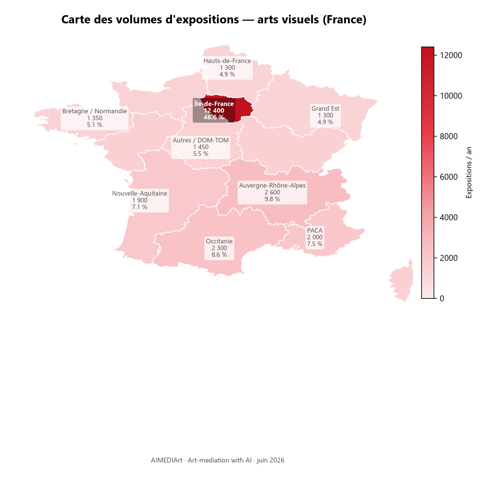
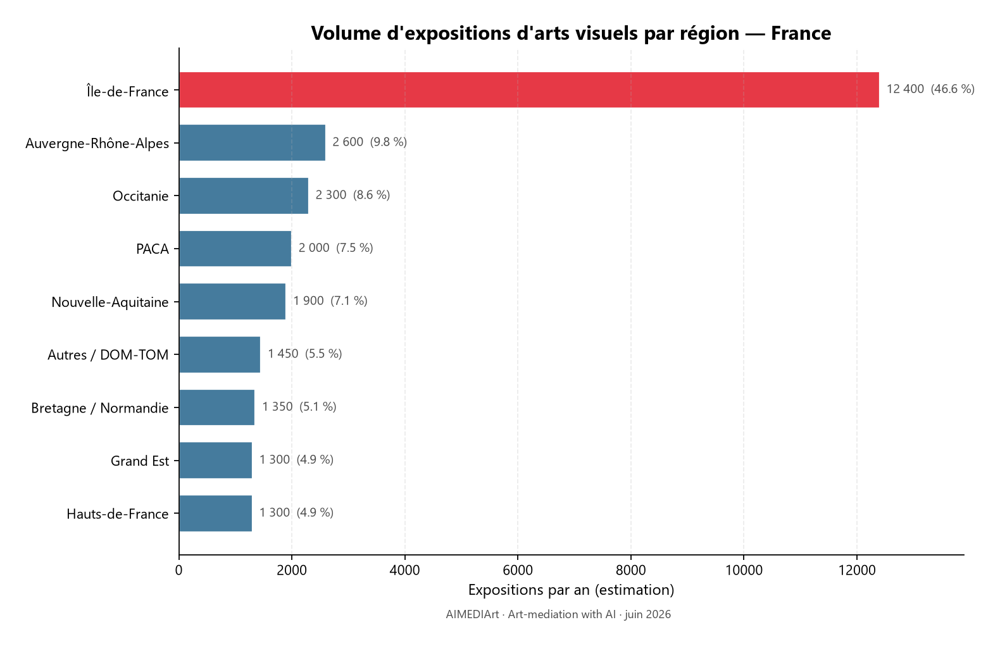
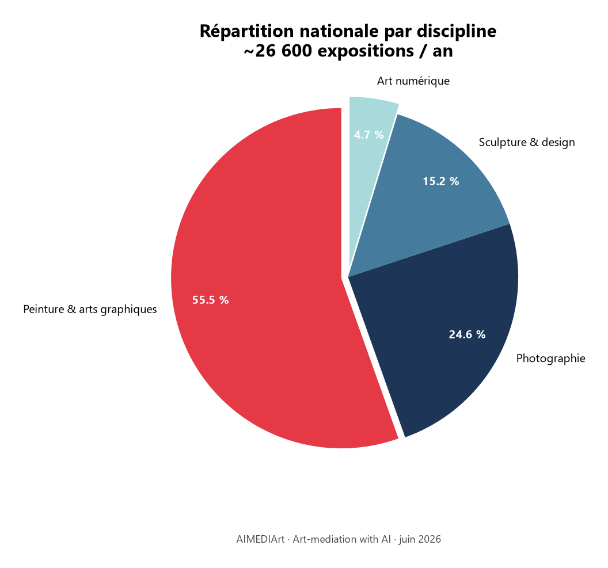
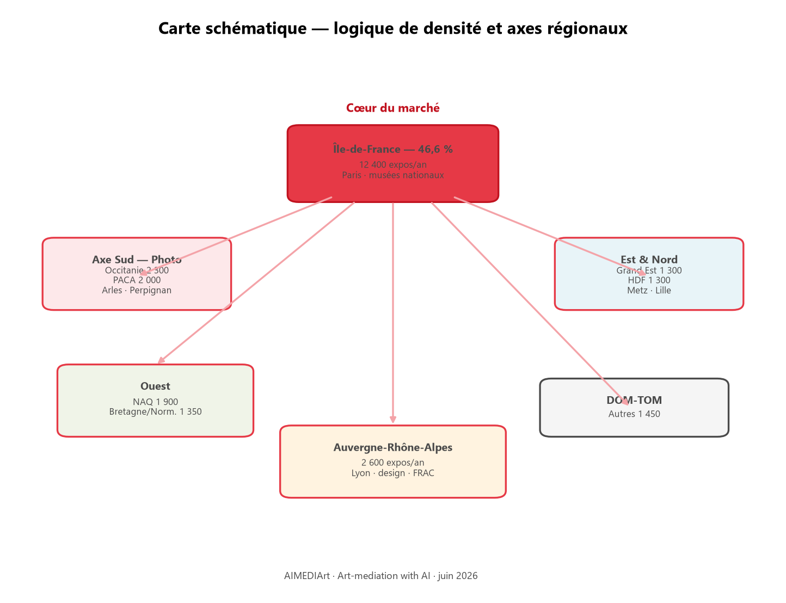
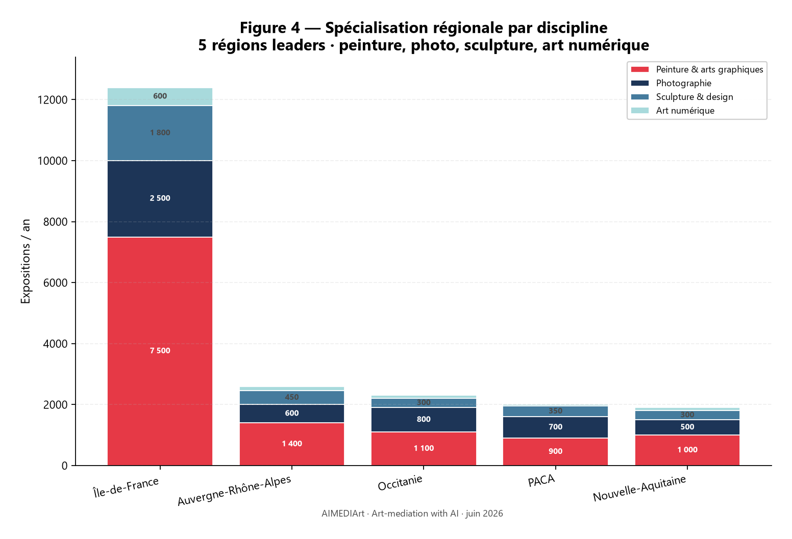
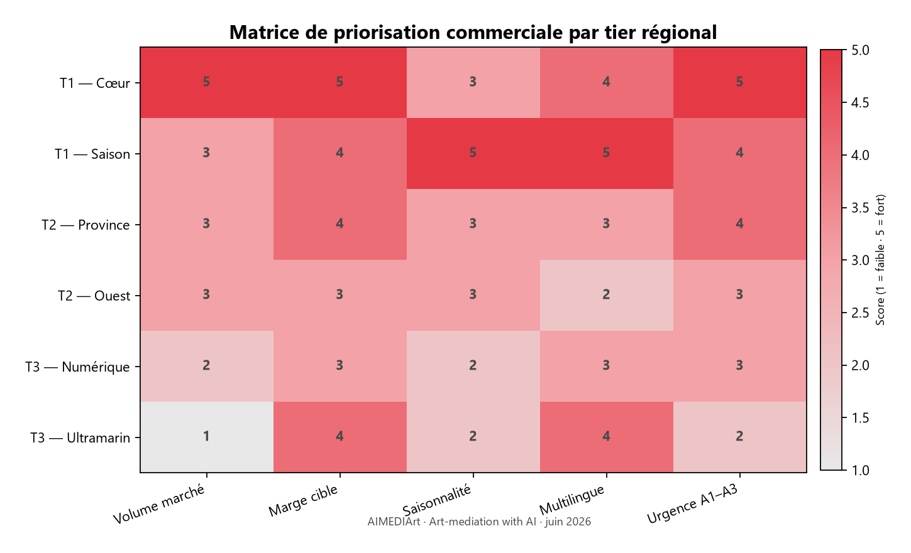
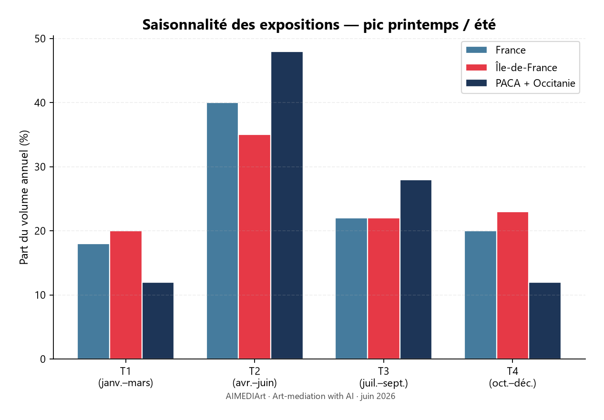
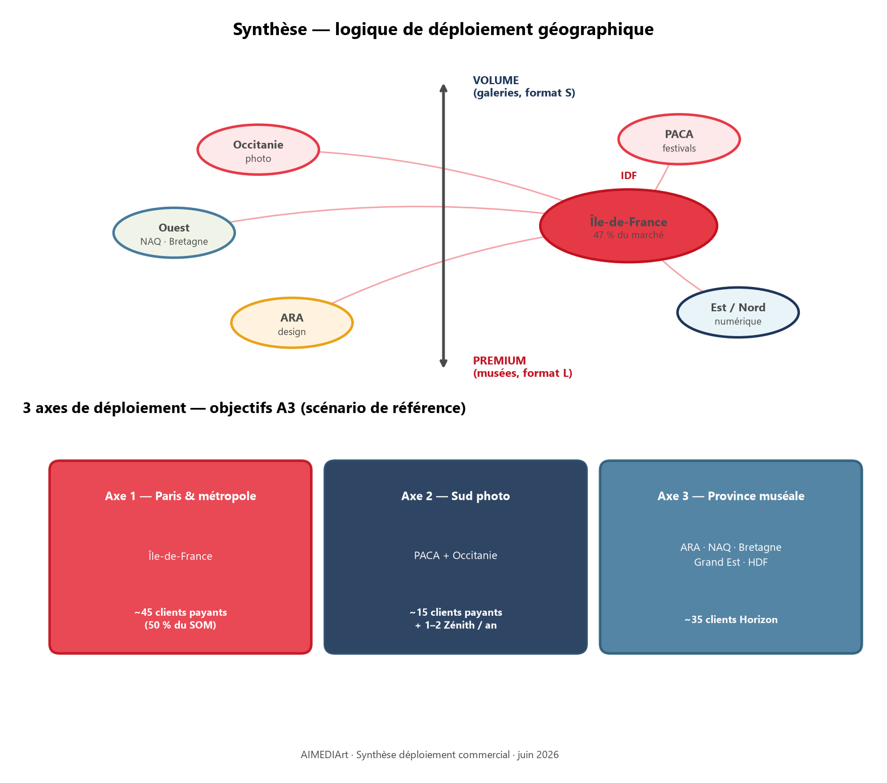

# Cartographie du marché français — AIMEDIArt

**Arts visuels · expositions annuelles · ventilée par région**  
*Source : étude « Marché des arts visuels » (hypothèses BP) · juin 2026*

---

## 1. Vue d’ensemble

Le marché français des expositions d’arts visuels est estimé à **~26 600 événements par an**[^total], répartis sur 9 grandes aires géographiques. Il n’existe pas de registre national exhaustif des petites expositions locales : les chiffres ci-dessous sont une **extrapolation** à partir des données du Ministère de la Culture (DEPS), des réseaux professionnels (DCA[^dca], ICOM[^icom]) et de la densité connue des galeries et musées.

**Enjeu stratégique pour AIMEDIArt :** identifier où se concentrent le **volume** (galeries, renouvellement rapide) vs le **premium** (musées, blockbusters[^blockbusters], grands publics) pour prioriser l’acquisition commerciale région par région.

---

## 2. Carte des volumes par région



*Figure 1 — Choroplèthe : densité estimée d'expositions d'arts visuels par grande région (source : étude marché, juin 2026).*



*Figure 2 — Classement des régions par volume annuel d'expositions.*

### 2.1 Tableau principal — expositions / an

| Région | Peinture & arts graphiques | Photographie | Sculpture & design | Art numérique & vidéo | **Total régional** | **Part nationale** |
|--------|---------------------------:|-------------:|-------------------:|----------------------:|-------------------:|-------------------:|
| **Île-de-France** | 7 500 | 2 500 | 1 800 | 600 | **12 400** | **46,6 %** |
| **Auvergne-Rhône-Alpes** | 1 400 | 600 | 450 | 150 | **2 600** | 9,8 % |
| **Occitanie** | 1 100 | 800 | 300 | 100 | **2 300** | 8,6 % |
| **PACA** | 900 | 700 | 350 | 50 | **2 000** | 7,5 % |
| **Nouvelle-Aquitaine** | 1 000 | 500 | 300 | 100 | **1 900** | 7,1 % |
| **Bretagne / Normandie** | 700 | 400 | 200 | 50 | **1 350** | 5,1 % |
| **Autres (DOM-TOM inclus)** | 800 | 400 | 200 | 50 | **1 450** | 5,5 % |
| **Hauts-de-France** | 700 | 350 | 200 | 50 | **1 300** | 4,9 % |
| **Grand Est** | 650 | 300 | 250 | 100 | **1 300** | 4,9 % |
| **TOTAL FRANCE** | **~14 750** | **~6 550** | **~4 050** | **~1 250** | **~26 600** | 100 % |

### 2.2 Représentation visuelle — part du volume national



*Figure 3 — Ventilation nationale par discipline artistique.*

```
Île-de-France          ████████████████████████████████████████████████  46,6 %
Auvergne-Rhône-Alpes   ██████████                                         9,8 %
Occitanie              █████████                                          8,6 %
PACA                   ████████                                           7,5 %
Nouvelle-Aquitaine     ███████                                            7,1 %
Bretagne / Normandie   █████                                              5,1 %
Autres / DOM-TOM       ██████                                             5,5 %
Hauts-de-France        █████                                              4,9 %
Grand Est              █████                                              4,9 %
```

### 2.3 Carte schématique (logique de densité)



*Schéma 2.3 — Hub Île-de-France et axes Sud (photo), Est/Nord (numérique), Ouest et province.*

---

## 3. Spécialisations régionales

| Région | Dominante | Piliers & réseaux | Implication AIMEDIArt |
|--------|-----------|-------------------|------------------------|
| **Île-de-France** | Peinture & arts graphiques (60 % de l’offre locale) | ~1 100 galeries parisiennes · Musées nationaux (Orsay, Beaubourg, Louvre…) · MAD Paris | **Priorité n°1** — volume + premium · plans Horizon / Rayonnement |
| **PACA** | Photographie | **Arles** (~40 expos officielles + 100+ off en été) · Paris Photo ( métropole ) · Marseille | Pic saisonnier avril–juillet · cible **Zénith** festivals |
| **Occitanie** | Photographie | Toulouse · **Perpignan** (Visa pour l’Image) · Montpellier | Forte adéquation médiation multilingue (tourisme) |
| **Auvergne-Rhône-Alpes** | Design & sculpture | **Cité du Design** (Saint-Étienne) · Lyon (Musée des Beaux-Arts, MAC) · FRAC[^frac] Auvergne | Plan Horizon (60–100 œuvres/expo) |
| **Nouvelle-Aquitaine** | Peinture & arts graphiques | Bordeaux · Biarritz · Musée des Beaux-Arts régionaux | Croissance province · Atelier → Horizon |
| **Grand Est** | Art numérique (rattrapage) | Metz (Centre Pompidou-Metz) · Strasbourg · arts immersifs | Early adopters **art numérique** · QR + expérience mobile |
| **Hauts-de-France** | Art numérique & patrimoine | Lille (Palais des Beaux-Arts) · Lens (Louvre-Lens) · LaM | Musées territoriaux format M |
| **Bretagne / Normandie** | Équilibre multi-catégories | Rennes · Nantes · Rouen · FRAC Bretagne | Tissu intermédiaire · réseau DCA[^dca] |
| **Autres / DOM-TOM** | Volume dispersé | Antilles · Réunion · Mayotte · Corse | Phase 3 · partenariats institutionnels |

---

## 4. Répartition par discipline (vue nationale → régionale)



*Figure 4 — Spécialisation régionale : peinture, photo, sculpture, art numérique.*

### 4.1 Peinture & arts graphiques (~14 750 expos/an)

| Rang | Région | Volume | Part catégorie |
|------|--------|-------:|---------------:|
| 1 | Île-de-France | 7 500 | 50,8 % |
| 2 | Auvergne-Rhône-Alpes | 1 400 | 9,5 % |
| 3 | Occitanie | 1 100 | 7,5 % |
| 4 | Nouvelle-Aquitaine | 1 000 | 6,8 % |
| 5 | PACA | 900 | 6,1 % |

→ Catégorie la plus « parisienne » : **1 Parisien sur 2** (en volume d’expositions peinture/graphiques).

### 4.2 Photographie (~6 550 expos/an)

| Rang | Région | Volume | Part catégorie |
|------|--------|-------:|---------------:|
| 1 | Île-de-France | 2 500 | 38,2 % |
| 2 | **Occitanie** | **800** | **12,2 %** |
| 3 | **PACA** | **700** | **10,7 %** |
| 4 | Auvergne-Rhône-Alpes | 600 | 9,2 % |
| 5 | Nouvelle-Aquitaine | 500 | 7,6 % |

→ **Axe Sud** (Occitanie + PACA = 23 %) surperforme sa part globale : hub photo (Arles, Perpignan, Montpellier).

### 4.3 Sculpture & design (~4 050 expos/an)

| Rang | Région | Volume | Part catégorie |
|------|--------|-------:|---------------:|
| 1 | Île-de-France | 1 800 | 44,4 % |
| 2 | Auvergne-Rhône-Alpes | 450 | 11,1 % |
| 3 | PACA | 350 | 8,6 % |
| 4 | Occitanie | 300 | 7,4 % |
| 5 | Grand Est | 250 | 6,2 % |

→ Portée par les **FRAC** et pôles design (Saint-Étienne, Paris).

### 4.4 Art numérique & nouveaux médias (~1 250 expos/an)

| Rang | Région | Volume | Part catégorie |
|------|--------|-------:|---------------:|
| 1 | **Île-de-France** | **600** | **48,0 %** |
| 2 | Auvergne-Rhône-Alpes | 150 | 12,0 % |
| 3 | Occitanie / NAQ / GE | 100 chacune | 8,0 % |

→ Catégorie la plus rare et la plus **centralisée** ; Grand Est et Hauts-de-France en rattrapage (arts immersifs).

---

## 5. Estimation du SAM[^sam] par région

*Hypothèse : SAM national = ~3 750 structures abonnables*[^sam-est] *(musées, centres d’art, galeries premium, FRAC) — répartition proportionnelle au volume d’expositions.*

| Région | Part expositions | **SAM estimé** | Structures clés |
|--------|----------------:|---------------:|-----------------|
| Île-de-France | 46,6 % | **~1 750** | 1 100 galeries Paris · musées nationaux · Centquatre · Gaîté Lyrique |
| Auvergne-Rhône-Alpes | 9,8 % | **~370** | MAC Lyon · FRAC · Cité du Design |
| Occitanie | 8,6 % | **~320** | Frac Occitanie · centres photo |
| PACA | 7,5 % | **~280** | Rencontres d’Arles · FRAC PACA |
| Nouvelle-Aquitaine | 7,1 % | **~265** | CAPC Bordeaux · Musée des Beaux-Arts |
| Bretagne / Normandie | 5,1 % | **~190** | FRAC Bretagne · centres d’art Nantes/Rennes |
| Autres / DOM-TOM | 5,5 % | **~205** | Institutions locales dispersées |
| Hauts-de-France | 4,9 % | **~185** | Louvre-Lens · LaM · Palais des Beaux-Arts Lille |
| Grand Est | 4,9 % | **~185** | Centre Pompidou-Metz · Frac Lorraine / Alsace |
| **TOTAL** | 100 % | **~3 750** | — |

**Objectif SOM[^som] A3 (scénario base) :** 95 clients payants = **~2,5 % du SAM national**, mais **~5,4 % du SAM IdF** si acquisition parisienne dominante — d’où l’intérêt d’une expansion province dès A2.

---

## 6. Matrice de priorisation commerciale AIMEDIArt



*Figure 5 — Scoring par tier régional (volume, marge, saisonnalité, multilingue, urgence).*

| Tier | Régions | Rationale | Plan cible | Horizon |
|------|---------|-----------|------------|---------|
| **T1 — Cœur** | Île-de-France | 47 % du volume · musées nationaux + galeries | Atelier → Horizon → Rayonnement | A1–A3 |
| **T1 — Saison** | PACA, Occitanie | Festivals photo · tourisme international · multilingue | Horizon · **Zénith** (Arles, Visa) | A2 (avril–juil.) |
| **T2 — Province M** | Auvergne-Rhône-Alpes, Nouvelle-Aquitaine | Musées territoriaux format M (~60 œuvres) | Horizon | A2–A3 |
| **T2 — Ouest** | Bretagne / Normandie | Centres d’art DCA · tissu équilibré | Atelier → Horizon | A2–A3 |
| **T3 — Niche numérique** | Grand Est, Hauts-de-France | Art numérique · arts immersifs · early adopters | Horizon · démos stats + carte | A3 |
| **T3 — Ultramarin** | DOM-TOM | Volume faible mais institutionnalisable | Partenariats · Rayonnement | A3+ |

---

## 7. Saisonnalité régionale



*Figure 6 — Pic avril–juillet (~40 % du volume national) ; surperformance PACA + Occitanie en été.*

| Période | Dynamique | Régions les plus actives |
|---------|-----------|--------------------------|
| **Janv.–mars** | Creux relatif · montage expos printemps | IdF (préparation), musées |
| **Avril–juillet** | **~40 % du volume annuel** | PACA (Arles), Occitanie, IdF (foires) |
| **Sept.–déc.** | Rentrée culturelle · expos temporaires musées | IdF, ARA, NAQ |
| **Toute l’année** | Galeries (rotation 6–8 semaines) | IdF surtout, métropoles province |

**Conséquence produit :** pousser le **plan veille** (19–49 €/mois) hors saison dans les régions festivalières (PACA, Occitanie).

---

## 8. Formats d’exposition par type de lieu (rappel national)

| Type de lieu | Œuvres moy. | Durée | Régions typiques |
|--------------|------------:|-------|------------------|
| Galerie privée | 15–35 | 6 sem. | IdF (70 % vol. format S) |
| Musée province / FRAC | 60–100 | 3–4 mois | ARA, NAQ, Bretagne |
| Grand musée national | 120–250+ | 4 mois | IdF (Orsay, Louvre, Beaubourg) |
| Centre d’art contemporain | 10–40 | 3 mois | Réseau DCA (51 centres) |

**Adéquation plans AIMEDIArt :**

| Format | Part volume | Plan recommandé |
|--------|------------:|-----------------|
| S (galeries) | 70 % | Étincelle → **Atelier** |
| M (musées territ.) | 25 % | **Horizon** |
| L (blockbusters) | 5 % | **Rayonnement / Zénith** |

---

## 9. Réseaux professionnels — ancrage géographique

| Réseau | Couverture | Siège / ancrage FR | Intérêt AIMEDIArt |
|--------|------------|--------------------|-------------------|
| **DCA** | 51 centres d’art FR | Paris | Canal d’acquisition **prioritaire** (format M) |
| **ACCR** | 43 CCR, ~30 en France | Paris | Lieux patrimoine + création contemporaine |
| **ICOM** | 139 pays | **Paris** | Légitimité muséale internationale |
| **NEMO** | 40 pays UE | Berlin (EU) | Expansion européenne A3+ |
| **FRAC** | 28 collections régionales | 1 par grande région | Sculpture / contemporain · quotas Horizon |

---

## 10. Synthèse — 3 axes de déploiement



*Figure 7 — Logique Volume / Premium et objectifs A3 par axe géographique.*

| Axe | Régions | Objectif A3 (indicatif) |
|-----|---------|-------------------------|
| **Paris & métropole** | IdF | ~45 clients payants (50 % du SOM) |
| **Axe Sud photo** | PACA + Occitanie | ~15 clients + 1–2 Zénith/an |
| **Province muséale** | ARA, NAQ, Bretagne, GE, HDF | ~35 clients Horizon |

---

## Notes de bas de page

[^total]: Estimation cumulée peinture + photo + sculpture/design + art numérique ; fourchette haute du marché français : 25 000–30 000 expositions/an toutes catégories confondues.
[^dca]: **DCA** — réseau de 51 centres d’art contemporain en France (~1,6 M visiteurs/an).
[^icom]: **ICOM** — *International Council of Museums*, organisation mondiale des musées (siège Paris).
[^frac]: **FRAC** — *Fonds Régionaux d'Art Contemporain*, 28 structures en France métropolitaine et outre-mer.
[^blockbusters]: Expositions à très forte affluence (rétrospectives majeures), format L (~180 œuvres).
[^sam]: **SAM** (*Serviceable Addressable Market*) — structures réalistes abonnables au produit actuel.
[^sam-est]: Fourchette retenue : 3 500–4 000 structures ; midpoint 3 750 utilisé pour la ventilation régionale.
[^som]: **SOM** (*Serviceable Obtainable Market*) — clients captés à horizon 3 ans (95 payants en scénario base).

---

*Document complémentaire au business plan AIMEDIArt · `docs/business-plan-aimediart.md`*
