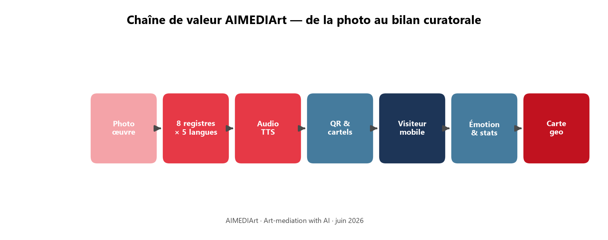
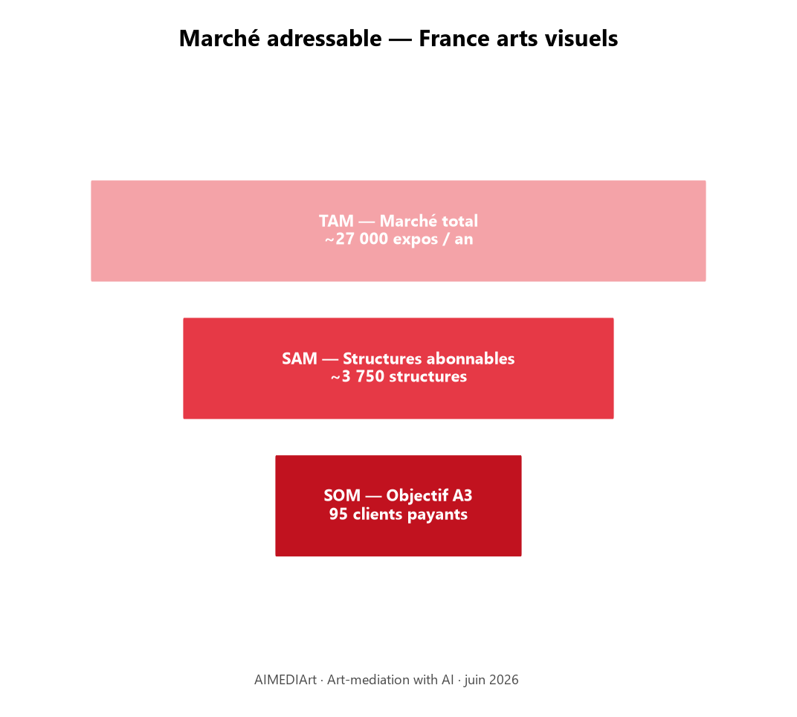
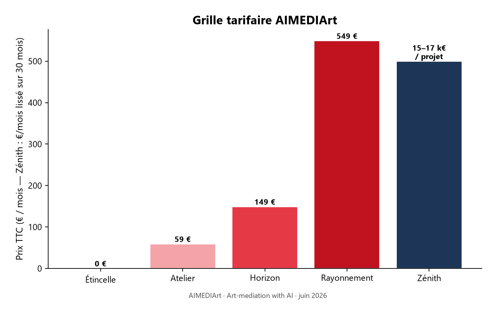
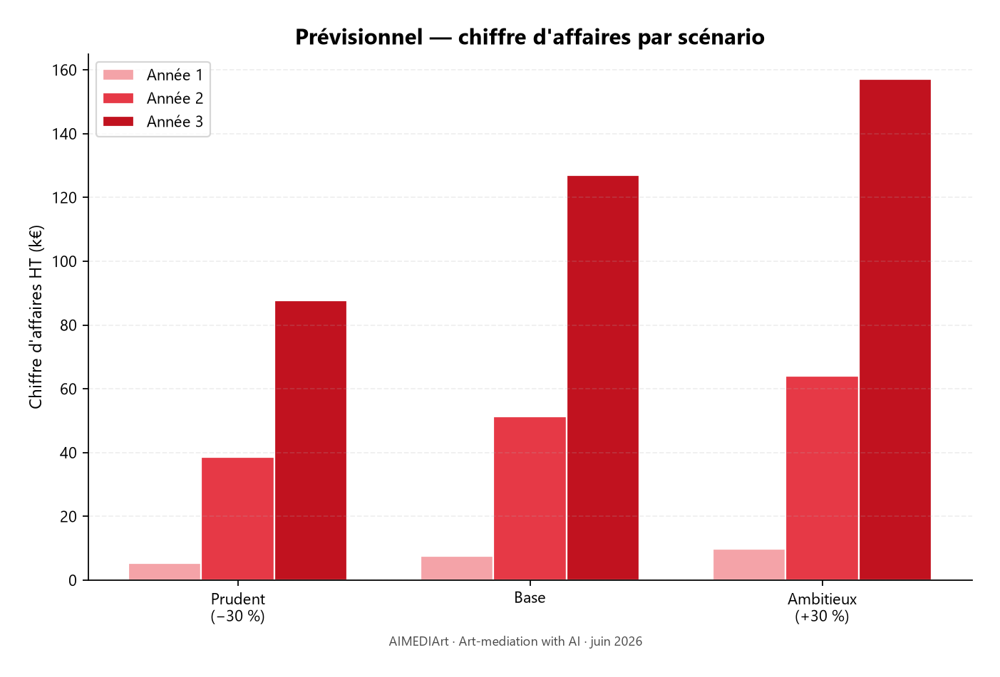
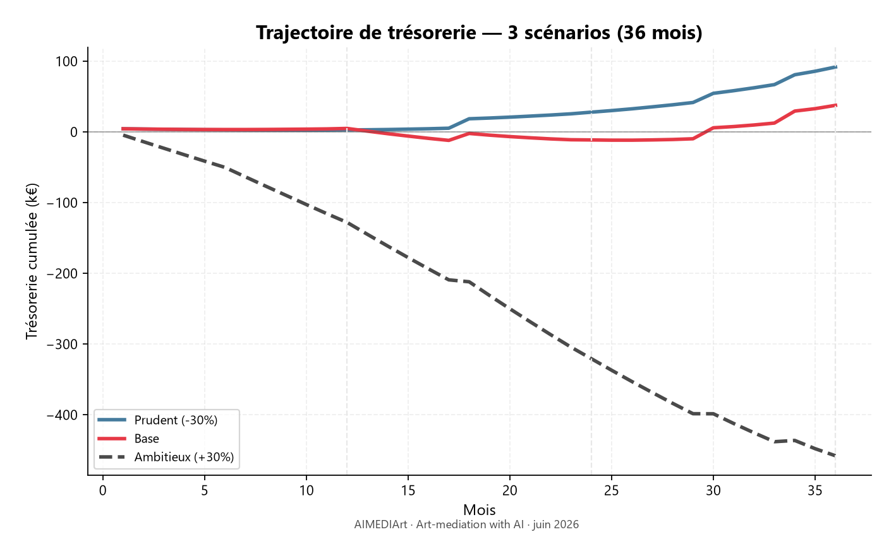
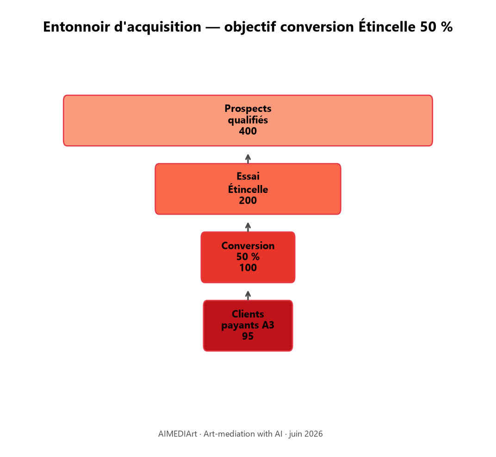

# AIMEDIArt — Pitch investisseur (10 slides)

*Art-mediation with AI · juin 2026*

---

## Slide 1 — Couverture

**AIMEDIArt**  
*La médiation culturelle, enfin à la hauteur de vos expositions*

- SaaS B2B[^saas] pour institutions culturelles (musées, centres d’art, galeries)
- Production IA + audioguides + QR + analytics émotion & géographie
- **aimediart.com** · DUPONT Fabien · Dépôt e-Soleau INPI juin 2026

---

## Slide 2 — Le problème

**Aujourd’hui, la médiation culturelle est lente, uniforme et peu mesurable.**

| Pain point | Conséquence |
|------------|-------------|
| Outils éparpillés (textes, studio, traductions) | **Semaines** de préparation par exposition |
| Un seul discours par œuvre | Visiteur enfant ≠ visiteur expert |
| Compteurs de passages | Aucune **émotion** ni **origine géographique** du public |
| QR vers pages statiques | Expérience figée, sans personnalisation |

> *40 % des expositions ont lieu avril–juillet — la production doit être 10× plus rapide.*

---

## Slide 3 — La solution

**Une chaîne unifiée, de la photo au bilan curatorale.**



```
Photo œuvre → 8 registres × 5 langues × audio → Cartel QR → Visiteur mobile (sans app)
            → Émotion à chaud → Stats + carte géographique → Export rapports
```

**Différenciation :**
- IA accélère · l’humain valide
- Zéro friction visiteur (scan QR)
- Mesure qualitative **par œuvre**, pas en fin de visite

---

## Slide 4 — Marché

**France — arts visuels**

| Niveau | Volume | Cible AIMEDIArt |
|--------|--------|---------------|
| **TAM**[^tam] | ~27 000 expos/an | Toutes expositions médiables |
| **SAM**[^sam] | ~3 500–4 000 structures | Musées, centres d’art, galeries premium |
| **SOM**[^som] A3 (base) | **95 clients payants** | ~2,5–3 % du SAM en 3 ans |

**Réseaux d’accès :** DCA[^dca] (51 centres), Musées de France (1 220), ICOM[^icom], NEMO[^nemo], ACCR[^accr]

**Segmentation expos :** Format S (70 % volume) · M (25 %) · L — *blockbusters*[^blockbusters] (5 % volume, 60 % public)



---

## Slide 5 — Modèle économique

**Revenus récurrents + upsell + grands comptes**

| Plan | Prix TTC/mois | Cible |
|------|---------------|-------|
| Étincelle | 0 € (essai 30 j) | Acquisition |
| Atelier | 59 € | Galeries, petites expos |
| Horizon | 149 € | Musées territoriaux, centres d’art |
| Rayonnement | 549 €/mois · 6 039 €/an | Grands comptes |
| Zénith | 15–17 k€ / projet | Festivals, biennales |

**Leviers complémentaires :** dépassements quotas · options langues · plan veille · facturation annuelle (11 mois pour 12)



---

## Slide 6 — Produit & avancement

**Plateforme en production — stack moderne**

| Module | Statut |
|--------|--------|
| Workflow[^workflow] création œuvre guidé | ✅ Live |
| Génération textes IA (8 registres) + TTS[^tts] | ✅ Live |
| Abonnements Étincelle → Horizon | ✅ Live |
| Stats émotion + carte géographique | ✅ Live |
| Paiement Stripe + facturation auto | 🔜 A2 |

**Propriété intellectuelle :** enveloppe e-Soleau (juin 2026) · codebase Supabase + React

---

## Slide 7 — Prévisionnel — 3 scénarios (36 mois)

*Hypothèses BP · sous-traitance dev incluse*

| Scénario | CA HT A3 | EBITDA A3 | Trésorerie A3 | Dev externalisés |
|----------|----------|-----------|---------------|------------------|
| **Prudent** (−30 % clients) | 84 k€ | 61 k€ | 88 k€ | 0 |
| **Base** | 127 k€ | 49 k€ | 38 k€ | 1 dev dès A2 |
| **Ambitieux** (+30 % clients) | 151 k€ | −143 k€ | −466 k€ | 5 dev (montée progressive) |

**Scénario base (référence) :**
- MRR[^mrr] TTC fin A3 : **~13 980 €** · ARR[^arr] : **~168 k€**
- **1 développeur** sous-traité (4 500 € HT/mois) à partir de l’année 2
- Bootstrap initial : 4 900 € — **pas de dilution en scénario prudent**

**Scénario ambitieux :** accélération produit (5 dev) → **besoin de financement** ~500 k€ pour couvrir le burn[^burn]





---

## Slide 8 — Unit economics

| KPI[^kpi] | Atelier | Horizon |
|-----|---------|---------|
| **ARPU**[^arpu] TTC/mois | 59 € | 149 € |
| **Churn**[^churn] moyen | ~3 %/mois | ~1,5 %/mois |
| **LTV**[^ltv] TTC estimée | ~1 900 € | ~9 900 € |

**Mécaniques de rétention :**
- Churn décroissant (−10 %/mois sur le taux après M9)
- Upsell[^upsell] naturel via quotas (dépassements → upgrade Horizon / Rayonnement)
- Plan veille hors saison (19–49 €/mois)

**Marge brute logicielle :** ~80 % avant sous-traitance dev (COGS[^cogs] IA + infra)

---

## Slide 9 — Go-to-market & roadmap

**Phase 1 (A1) — Validation**
- Entonnoir Étincelle → 15 clients payants
- Ciblage DCA + musées territoriaux (format M, ~60 œuvres/expo)




**Phase 2 (A2) — Accélération**
- Horizon = cœur de marge (35 clients)
- 1er Zénith (15 k€) · réseaux festivals photo (Arles, Perpignan)

**Phase 3 (A3) — Scale**
- 70 Horizon · 5 Rayonnement · expansion EU (5 langues prêtes)

**Canaux :** vente directe · réseaux pro · partenaires commissaires · BO curatoral

---

## Slide 10 — L’opportunité & la demande

**Pourquoi investir maintenant ?**

1. **Double mutation** : numérisation visiteurs + IA génératrice de contenus
2. **Produit live** avec IP protégée — pas un PowerPoint
3. **Marché fragmenté** — aucun acteur n’intègre production + personnalisation + mesure émotion
4. **Revenus récurrents** sur un SAM de ~4 000 structures en France seule

**Use of funds (scénario ambitieux) :**
- 60 % — équipe produit (5 dev sous-traités / salariés)
- 25 % — commercial & marketing (réseaux culturels)
- 15 % — infra IA & conformité (RGPD, scalabilité EU)

**Contact :** [votre email] · **aimediart.com**

---

## Notes de bas de page (pitch)

[^saas]: **SaaS** (*Software as a Service*) — logiciel accessible en ligne par abonnement, sans installation.
[^tam]: **TAM** (*Total Addressable Market*) — marché total théorique adressable.
[^sam]: **SAM** (*Serviceable Addressable Market*) — segment réaliste ciblable avec le produit actuel.
[^som]: **SOM** (*Serviceable Obtainable Market*) — part de marché capturable à horizon 3 ans.
[^dca]: **DCA** — *Association de la Documentaton en Centres d'Art*, réseau de 51 centres d’art contemporain en France.
[^icom]: **ICOM** — *International Council of Museums*, organisation mondiale des musées (siège Paris).
[^nemo]: **NEMO** — *Network of European Museum Organisations*, fédération européenne d’organisations de musées.
[^accr]: **ACCR** — *Association des Centres Culturels de Rencontre*, 43 centres dans 15 pays.
[^blockbusters]: Expositions à très forte affluence (ex. rétrospectives majeures au Musée d’Orsay) — format L (~180 œuvres).
[^workflow]: **Workflow** — parcours guidé pas-à-pas dans l’interface (création œuvre → médiation → audio → QR).
[^tts]: **TTS** (*Text-to-Speech*) — synthèse vocale pour les audioguides.
[^mrr]: **MRR** (*Monthly Recurring Revenue*) — revenu mensuel récurrent.
[^arr]: **ARR** (*Annual Recurring Revenue*) — MRR × 12.
[^kpi]: **KPI** (*Key Performance Indicator*) — indicateur clé de performance.
[^arpu]: **ARPU** (*Average Revenue Per User*) — revenu moyen par client et par mois.
[^churn]: **Churn** — taux de désabonnement mensuel.
[^ltv]: **LTV** (*Lifetime Value*) — revenu total généré par un client sur toute sa durée de vie.
[^upsell]: **Upsell** — vente additionnelle ou passage à un plan supérieur.
[^cogs]: **COGS** (*Cost of Goods Sold*) — coût direct de service (IA, hébergement).
[^burn]: **Burn** — consommation de trésorerie mensuelle nette (cash burn).

*Annexe chiffrée : `docs/business-plan-previsionnel-36m-new.xlsx`*
